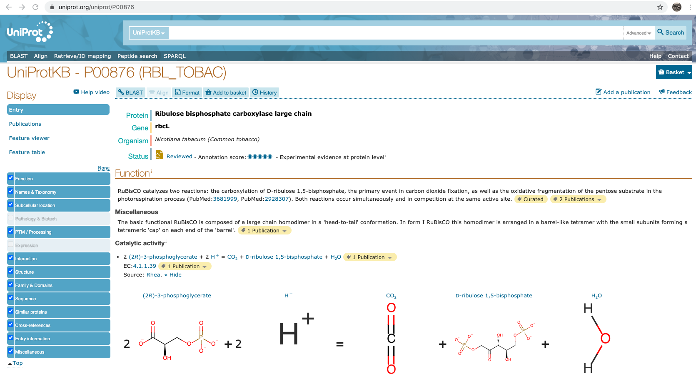

```{r load_packages, eval = TRUE, echo=FALSE}
library(BiocStyle)
library(drawProteins)
library(httr)
library(ggplot2)
library(knitr)
```

# Drawing Rubisco large subunit with the drawProteins package
This package draws protein schematics using data from the Uniprot Protein Database. 

The basic workflow is:

1. to provide one or more Uniprot IDs  
2. get a list of feature from the Uniprot API  
3. draw the basic chains of these proteins  
4. add features as desired  

# Example workflow: Ribulose-1,5-bisphosphate carboxylase/oxygenase large subunit (rbcL)

Firstly, find the protein of interest (rbcL in this instance) at [UniProt]("https://www.uniprot.org/uniprot/Q43088")  

{width=70%}


Now import the relevant structural information from UniProt using this code that calls the `get_features()` function of the package:
```{r download_rel_json, eval=TRUE, echo=TRUE}
# accession number of Rubisco from Pisum sativum
    drawProteins::get_features("P00876") ->
    rel_json
```

# Turning Uniprot data into a dataframe
The `get_features()` function returns a list of values that has to be converted to a dataframe before it can be graphed using ggplot2. The `feature_to_dataframe()` function does this conversion and also orders the data:

```{r generate_dataframe}
drawProteins::feature_to_dataframe(rel_json) -> rel_data

# show in console
head(rel_data[1:4])

```


# Draw the protein chains and domains
The first step is to make a canvas with `draw_canvas()`:

```{r using_draw_canvas, fig.height=3, fig.wide = TRUE}
p <- draw_canvas(rel_data)
p
```


Then we can plot the protein using the `draw_chain()` function to which
we have to provide the ggplot object `p` and the data which is 
called `rel_data`.
```{r using draw_chains, fig.height=3, fig.wide = TRUE}
p <- draw_chains(p, rel_data)
p
```


Now, we add the domains which are drawn to scale in terms of their lengths. We
use the `draw_domains()` function to which we have to provide the
ggplot object `p` and the data which is called `rel_data`. 
The default is to label the chains. The labels can be removed using the 
argument `label_chains = FALSE`.
```{r using draw_domains, fig.height=3, fig.wide = TRUE}
p <- draw_domains(p, rel_data)
p
```

The graph can be tidied up by adding a white background, removing
the y-axis and grid and adjusting the size of the text using the base_size argument. 
This can be done with this code:
```{r white_background, fig.height=3, fig.wide = TRUE}
# white background and remove y-axis
p <- p + theme_bw(base_size = 20) + # white background
    theme(panel.grid.minor=element_blank(), 
        panel.grid.major=element_blank()) +
    theme(axis.ticks = element_blank(), 
        axis.text.y = element_blank()) +
    theme(panel.border = element_blank())
p
```


### Adding titles to the plots 

Using ggplot2 then allows the addition of titles:
```{r add_titles, fig.height=4, fig.wide = TRUE}
# add titles
rel_subtitle <- paste0("circles = phosphorylation sites\n",
                "RHD = Rel Homology Domain\nsource:Uniprot")

p <- p + labs(title = "Rel A/p65",
                subtitle = rel_subtitle)
p
```

# Session info
Here is the output of `sessionInfo()` on the system on which this document was
compiled:
```{r session_Info, echo=FALSE}
sessionInfo()
```
